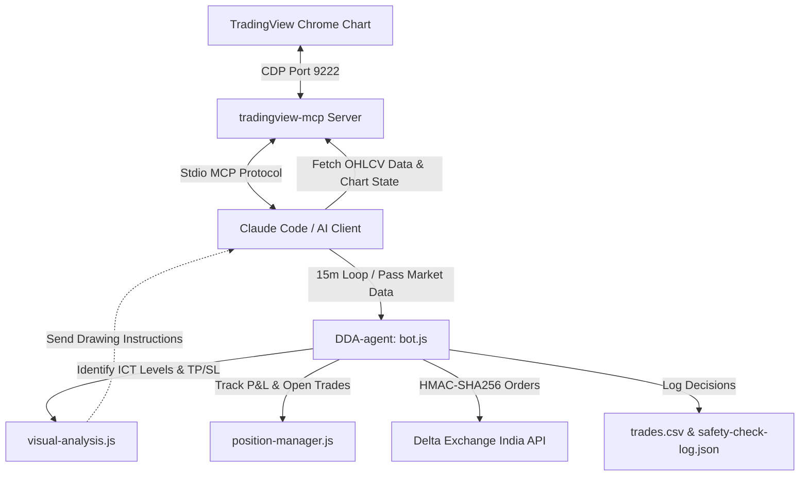

# DDA Agent Architecture Flowchart

```mermaid
graph TD
    %% Core Top-Level Components
    TV["TradingView Chrome Chart"]
    MCP["tradingview-mcp Server"]
    Claude["Claude Code / AI Client"]

    %% DDA Agent Core
    Bot["DDA-agent: bot.js"]

    %% Bot Modules & External Systems
    Visual["visual-analysis.js"]
    PosManager["position-manager.js"]
    Delta["Delta Exchange India API"]
    Logs["trades.csv & safety-check-log.json"]

    %% Relationships - Main Data Flow
    TV <-->|"CDP Port 9222"| MCP
    MCP <-->|"Stdio MCP Protocol"| Claude
    
    %% Claude Interactions
    Claude -->|"Fetch OHLCV Data & Chart State"| MCP
    Claude -->|"15m Loop / Pass Market Data"| Bot
    
    %% Bot execution paths
    Bot -->|"Identify ICT Levels & TP/SL"| Visual
    Bot -->|"Track P&L & Open Trades"| PosManager
    Bot -->|"HMAC-SHA256 Orders"| Delta
    Bot -->|"Log Decisions"| Logs
    
    %% Feedback loops
    Visual -.->|"Send Drawing Instructions"| Claude
```
